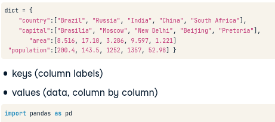

#### 1. Dictionaries
Là tập hợp các cặp ``key:value`` khi cần kết nối dữ liệu với nhau như 1 table để tra cứu nhanh và có thể chỉ ra unique keys khi tra cứu, thay vì nối 2 list lại để lấy index rồi tra cứu value.

* So sánh giữa list và dict:


* Cú pháp tạo dict như sau:

``my_dict = {
	key:value,
	key:value
}``


* Access dict như sau:
``my_dict['key']`` => cho ra value của key đó.

* Thêm key:value vào dict:
``world["sealand"] = 0.25``

* Check xem dict đã được thêm key ở trên vào chưa: 
``sealand in world`` => trả về True/False.
Với 'seadland' là key và word là tên dict.

* Cập nhật lại giá trị cho key ``sealand``:
``world['sealand'] = 0.28``
Vì key trong dict là unique nên Python hiểu là bạn muốn thay đổi giá trị chứ không phải tạo mới cặp key:value.

* Xóa cặp key:value:
``del(world['sealand'])``

* Dict trong dict:
Cũng như list có thể chứa list trong list. Xem ví dụ:
```
# Dictionary of dictionaries
europe = { 'spain': { 'capital':'madrid', 'population':46.77 },
           'france': { 'capital':'paris', 'population':66.03 },
           'germany': { 'capital':'berlin', 'population':80.62 },
           'norway': { 'capital':'oslo', 'population':5.084 } }
```
Để access giá trị của dict, ta sẽ dùng dấu [] như trong array:

``europe['spain']['population']``

=> Vậy để add thêm cặp key:dict vào trong dict trên thì làm thế nào?

```
# Create sub-dictionary data
data = {
    'capital':'rome',
    'population':59.83
}

# Add data to europe under key 'italy'
europe['italy'] = data
```

Ta chỉ cần tách ra tạo dict phụ trước và gán nó vào biến lưu object value. Sau đó ta thêm cặp key:value vào dict như bình thường.


Lưu ý:

* Keys không được trùng nhau trong 1 dict, vì nếu trùng, nó sẽ chỉ lấy giá trị cuối cùng.
* Keys phải là immutable object (không đổi), còn list thì mutable nên list cũng không được là key trong dict. 


#### 2. Pandas

##### Tabular dataset trong Python
row = observations

column = variable

* Để làm việc với dạng data này thì cần cấu trúc dạng chữ nhật.

=> 2D Numpy array

=> Nhưng với các dữ liệu có nhiều thông tin với nhiều datatype khác nhau như str, float,... thì Numpy chưa hiệu quả.

Vậy nên pandas package chính là solution và quen thuộc trong Data science. 

* Nó được build dựa trên Numpy.
* Là tool ở cấp độ cao trong thao tác với dữ liệu.
* Pandas lưu dữ liệu bảng trong object gọi là Dataframe.

Cách tạo dataframe từ dictionary:
```
import pandas as pd
brics = pd.DataFrame(dict)
```


Để tạo index cho observations trong df, ta dùng attribute ``index`` và gán 1 list với thứ tự chính xác các index mong muốn:
```
brics.index = [...,...]
```


##### CSV file 
Nhưng thực tế trong Data science, ta phải đối mặt với lượng data khổng lồ tùy trường hợp cụ thể, nên thông thường ta không tự tạo dataframe. Giả sử các data đến từ file có `.csv` viết tắt của comma separated values.

* Để import vào môi trường Python ta dùng cú pháp:

```
brics = pd.read_csv("path/to/brics.csv")
```
* Tuy nhiên đối với file có index, khi import vào thì cột index đầu tiên sẽ bị ngầm hiểu là cột đầu của dữ liệu chính. Để tránh điều này, ta phải thêm argument ``index_col=0``, kết quả:


* Để thay đổi index tự động từ 0-n bằng label được định nghĩa trong 1 list tạo riêng tự chọn, ta dùng cú pháp:
```
# Definition of row_labels
row_labels = ['US', 'AUS', 'JPN', 'IN', 'RU', 'MOR', 'EG']

# Specify row labels of cars
cars.index = row_labels
```

##### Cách để access Dataframe
Ta input vào label hoặc index của column hoặc row. Ví dụ cụ thể ta có df là cars, xem cú pháp dưới đây: 

* Access COLUMN (cột):
	* Dùng [] : 
	- Nếu muốn output là Series object: ``cars['country', ... ]``
	- Nếu muốn output là Dataframe, dùng double ngoặc vuông:
``cars[['country', ... ]]``
> Nhìn ở góc khác, ta đang input vào ngoặc vuông 1 list chứa column labels.

	* Dùng ``loc`` (chọn 1 phần data dựa trên label-based) hoặc ``iloc`` (chọn data dựa trên integer position-based)
	- cars.loc['country', ...] hoặc cars.loc[['country', ...]] 
	- car.iloc[0, ..., ...] hoặc car.iloc[[0, ..., ...]]
	
* Access ROW (quan sát)	
	* Chỉ có cách là dùng [] nhưng input vào số:
	- Nếu muốn lấy row từ index 1 đến 3:
``cars[1:4]`` 
	* Dùng loc hoặc iloc và input vào index của row thay vì tên cột như truy cập vào column.

* Access ROWs & COLUMNs bất kì:
	* Sử dụng loc và iloc tiện lợi:
	- Ta chỉ cần đặt vào label của row và column trong loc hoặc iloc theo thứ tự ``row, column``. 
	- Nếu chọn nhiều hơn 1 label trong row hoặc column, ta biến argument row hoặc column thành list.

Xem	 hình ví dụ:
	


	
> Nhận xét: 

- Dấu ngoặc vuông``[]`` có giới hạn chức năng và lý tưởng nhất là sử dụng trong 2D Numpy array để access value dễ dàng nhất.	
- Nếu muốn dấu``[]``có thể mở rộng khả năng access value trong pandas như  dấu``[]``trong 2D Numpy array, thì ta cần sử dụng ``loc`` và ``iloc``.


	
	
##### Filter dataframe

* Bước 1: Access cột trả về series object.

* Bước 2: Xác định điều kiện filter và trả về Boolean Series. Nếu > 2 điều kiện thì phải sử dụng Numpy variants của toán tử and, or, not.

* Bước 3: Dùng Boolean Series là kết quả của bước 1 làm input trong dấu ngoặc vuông của Dataframe. Kết quả trả về các record thỏa điều kiện.

> You'll want to build up a boolean Series, that you can then use to subset the cars DataFrame to select certain observations. If you want to do this in a one-liner, that's perfectly fine!


#### 3. LOOP

##### WHILE


##### FOR 

```
for var in seq :
	expression
```

Trong đó ``var`` là biến bất kỳ có thể đặt tên sao cũng được. Python dùng nó để quét lần lượt cái phần tử trong ``seq``.


FOR còn dùng để lặp từng char trong string.


* enumerate() : cung cấp 2 giá trị cho mỗi lần lặp gồm ``index`` và ``value (giá trị)``.


Mỗi data structure sẽ có cách loop các nhau và cách định nghĩa sequence khác nhau (seq). Cụ thể các bạn xem dưới đây nhé:

##### Loop với List của Lists 
* Nếu list mà bạn cần lặp là list của list, thì dùng cách như sau:

```
# house list of lists
house = [["hallway", 11.25], 
         ["kitchen", 18.0], 
         ["living room", 20.0], 
         ["bedroom", 10.75], 
         ["bathroom", 9.50]]
         
# Build a for loop from scratch
# x quét từng list trong list, dùng [] để truy cập phần tử của sub-list

for x in house :
    print("the " + x[0] + " is " + str(x[1]) + " sqm")
```

##### Loop với Dictionary
Sử dụng method ``items()`` :

``for key, val in my_dict.items() : ``


##### Loop với Numpy array 
Sử dụng function ``np.nditer(my_array)`` đặc biệt là với 2D array.

``for val in np.nditer(my_array) : ``

* Với 1D array ta có thể sử dụng loop thông thường, nhưng với 2D thì nó sẽ in ra 2D array thay vì ra các giá trị cần lấy trong loop.

* Dùng ``nditer`` sẽ giúp in ra từng giá trị từ trái sang phải từ trên xuống dưới của 2D array.


##### Pandas DataFrame

``iterrows()`` : Trong mỗi lần lặp, method này sẽ generate ra 2 giá trị:
* Label của row (nếu ko có thì là index tự động) 
* Data của row (là Pandas Series có index/label là tên cột - còn gọi là fieldname)


Để loop in ra giá trị của cột mong muốn cho mỗi lần lặp, ta chỉ cần:

print(row["tên cột"])


* Thêm cột vào Dataframe bằng loop:

Ví dụ ta muốn thêm cột tính độ dài của cột "country":
``brics.loc[lab, "tên cột mới"] = len(row["country"])``


> Nhận xét: Cách này tốt trong trường hợp ít record. Vì ta đang tạo ra Series object cho mỗi vòng lặp và nó sẽ không hiệu quả với các dataset khổng lồ, thậm chí gây ra vấn đề khi xử lý dữ liệu.

Vậy nên, cách tốt nhất là ta sử dụng function ``apply(tên function)`` cho mỗi cột mà ta muốn tính toán rồi gán vào cột mới trong dataframe:

``brics["cột mới"] = brics["country"].apply(len)``

> Cách hoạt động: Function ``apply()`` sẽ gọi function ``len()`` mà mỗi giá trị của cột country sẽ là input để tính độ dài từng country. Kết quả trả về là 1 array mà chúng ta có thể dễ dàng lưu thành cột mới trong Dataframe.
