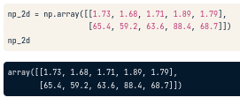

#### I. LIST

* Thêm phần tử cho list:

Chỉ cần + [list]
```
x = ["a", "b", "c", "d"]
y = x + ["e", "f"]
```
* Xóa phần tử list:

Dùng del(phần tử). Lưu ý là khi xóa thì các phần tử ở sau bị đẩy index lên.
```
x = ["a", "b", "c", "d"]
del(x[1])
```


* Dấu [index:index] trong list
	* x[start:end]
	Với start là chỉ số lấy
	end chỉ số không lấy
Ví dụ: 
	* x[2:5] : lấy giá trị của index từ 2 đến 4
	* x[:3] : từ đầu đến index 2
	* x[3:] : từ index 3 đến hết
	* x[:] : lấy hết phần tử
	
* Dấu ``;``:
Dùng để tách command code trên cùng 1 dòng, nếu khác dòng thì không cần. 
```
# Same line
command1; command2

# Separate lines
command1
command2
```

* Copy list:
Khi copy kiểu ``x=y`` thì thực tế ta đang copy địa chỉ list của y cho x. Nghĩa là khi ta thay đổi phần tử trong x thì y cũng thay đổi theo.

Để xử lý tình huống này, nếu chỉ muốn copy giá trị list thì ta dùng: ``x = list(y)`` hoặc ``x = y[:]``


* Convert datatype
x = str(y)
x = int(y)
x = float(y)
> Check datatype bằng function ``type()``

* Xem cấu trúc của 1 function có sẵn:
``help(max)`` hoặc ``?max``

#### II. METHOD
* Cũng là function nhưng dành cho từng type
* Tất cả mọi thứ trong Python đều là object.
* Object có các method riêng, phụ thuộc vào data type 

#### III. Numpy
Tại sao dùng Numpy?
*  Rất quyền lực, có thể sử dụng cho nhiều data type khác nhau. Tuy nhiên mỗi tập hợp (array) chỉ được chứa 1 loại data type.
* Có thể thêm, xóa, sửa
* Quan trọng trong Data Science
	* Làm các phép toán cho các tập hợp
	* Tốc độ nhanh
* Ta thấy nếu áp dụng phép toán như -*/ trên kiểu dữ liệu list thì sẽ throw Error ``không hỗ trợ``. Nếu + thì sẽ ghép 2 list lại thành 1 list.
> Tuy nhiên, ta đang cần +-*/ trên 2 list theo index tương ứng. Thì Numpy sẽ giúp ta giải quyết khó khăn này.

Giải pháp Numpy có gì?
* Python kiểu số. Có hàm ``np.mean()`` và ``np.median()`` rất phổ biến trong data science.
* Thay thế cho Python List : kiểu dữ liệu ``Numpy Array``
* Giúp tính toán trên toàn bộ array
* Nhanh và dễ dàng
* Cài đặt trong terminal: 
``pip3 install numpy``

Như vậy, để thực hiện các phép toán trên list, ta phải chuyển nó sang kiểu dữ liệu Numpy Array như sau:
```
import numpy as np
np_height = np.array(height)
np_weight = np.array(weight)
bmi = np_weight / np_height ** 2
```

**Lưu ý quan trọng:**

* Mỗi array chỉ được chứa 1 loại data type.
* Type khác nhau thì hành vi của nó sẽ khác nhau. VD: 

	* Phép + 2 list thì là ghép 2 list thành 1. 
	* Phép + 2 array thì là cộng theo giá trị index tương ứng của 2 array với nhau.

##### 1. Numpy Subsetting 
* Ta có array ``bmi``.
* Để truy cập vào array ta dùng cú pháp: ``bmi[index]``
* Để xét các giá trị trong array có thỏa điều kiện không, ta dùng: ``bmi > 23``
> Trả về array có kiểu Boolean (True/False)
* Để trả về array chứa các giá trị thỏa điều kiện, ta dùng: ``bmi[bmi > 23]`` 

##### 2. Type của Numpy array
Nếu ``print(type(np_height))``
> numpy.ndarray

Với numpy là package, n là layer của array. ndarray là kiểu dữ liệu chỉ sử dụng trong Numpy.

##### 3. 2D Numpy Arrays 
Cách tạo 2D array bằng 2 array:
* array1
* array2
* meas = np.array([array1, array2])


Có thể xem 2D numpy array như phiên bản nâng cấp của "list của list" vì ta có thể thực hiện các phép toán với nó.

Để tạo array 2D, ta chỉ cần input các giá trị vào như dưới đây, input 1 list có 2 sub-list vào argument của method ``np.array`` theo cấu trúc hình chữ nhật:


Mỗi sub-list là một row của array.  
Nếu ta thay đổi kiểu dữ liệu của bất kỳ giá trị nào trong array sang kiểu khác như từ float sang string, thì mặc nhiên numpy sẽ chuyển tất cả các giá trị còn lại sang string (in ra sẽ thấy).
> Vì mỗi numpy array chỉ chứa 1 kiểu dữ liệu.

Để biết cấu trúc data của array như thế nào, ta dùng attribute ``shape`` của array:

 *Vì là attribute nên nó không có ``()`` như method~*

Có 2 cú pháp để truy cập giá trị:


* Cách 1: np_2d[row][column]
* Cách 2: np_2d[row,column]
* Dấu ``:`` vẫn sẽ được sử dụng giống như 1D array ở trên nếu muốn chọn cụ thể vùng giá trị muốn lấy.

*Với row, column là index, chú ý ở đây vẫn sử dụng zero-index cho 2D array.*


##### 4. Toán tử Boolean trong Numpy
Với Numpy array ta có thể sử dụng phép so sánh như các ví dụ trên, nhưng nếu sử dụng kết hợp and, or, not thì sẽ throw Error.
Do vậy, ta phải sử dụng:

* np.logical_and()
* np.logical_or() 
* np.logical_not()

Ex:
```
np.logical_and(my_house > 13, 
               your_house < 15)

# Kết quả trả về 1 Boolean Series, thích hợp dùng để filter dataframe 
```
Với my_house và your_house là 2 Numpy array.
